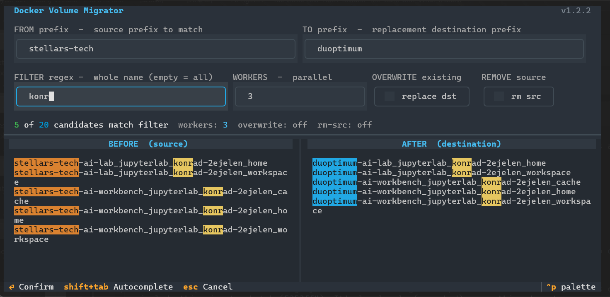
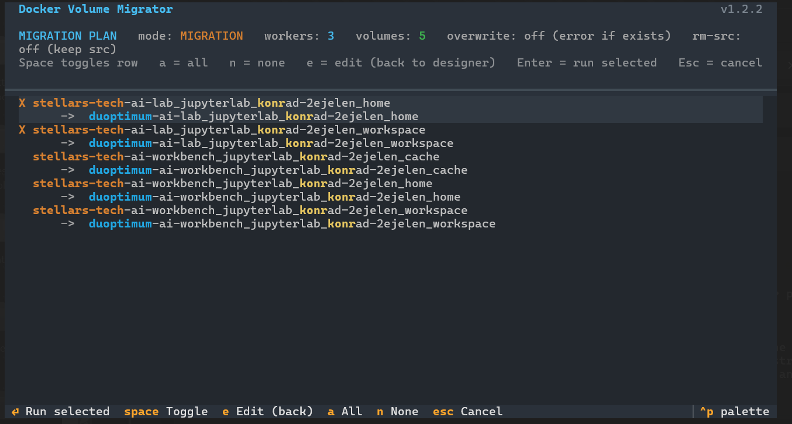
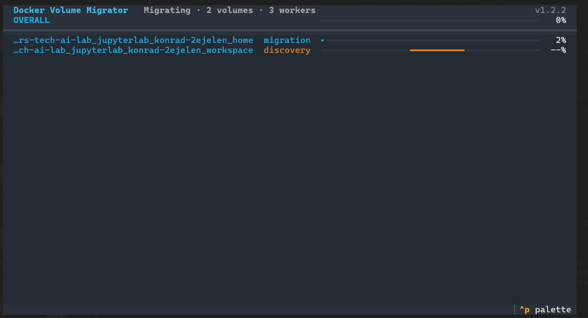

# docker-volume-migrator

A small command-line tool that copies Docker volumes from one name prefix to another. It
matches every volume named `{from_prefix}{tail}` and copies it to
`{to_prefix}{tail}`, preserving the tail (`_home`, `_workspace`, `_certs`, a
per-user suffix, anything that follows the prefix). Run it from the host that
owns the Docker volumes; it copies rather than renames, so the originals stay in
place until you have verified the result.

Run with no arguments for the interactive TUI - designer, plan, execution:



*Set the FROM and TO prefixes, an optional whole-name filter, the worker count, and the overwrite / remove-source toggles; a live counter shows how many discovered volumes match (`5 of 20`) and the BEFORE / AFTER panes preview the exact source and destination names.*



*Review each matched volume and its `source → destination` mapping; toggle rows with Space (a = all, n = none) and press Enter to run only the selected copies.*



*Live progress during the copy - an overall bar plus a per-volume bar for each parallel worker, moving through discovery and transfer.*

## When you need it

Docker namespaces volumes by `COMPOSE_PROJECT_NAME` (for example `myproject_data`,
`myproject_shared`), and many stacks add a per-entity prefix of their own
(`jupyterlab-<user>`). Whenever that prefix changes you would otherwise lose
access to the existing data:

- renaming a deployment (`COMPOSE_PROJECT_NAME` change) renames every
  `<old-project>_*` volume
- an upstream platform reworking its volume names across an upgrade

The migrator moves the data onto the new names so nothing is lost across the
rename.

## Usage

Run with no arguments for the interactive TUI (designer → plan → execution):

```bash
./migrate_volumes.py
```

Or drive it entirely from the command line:

```bash
# preview the mapping without copying
./migrate_volumes.py --from myproject_ --to mynewproject_ --dry-run

# copy, skipping the prompt
./migrate_volumes.py --from myproject_ --to mynewproject_ --yes

# only the cert volumes, four parallel workers
./migrate_volumes.py --from myproject_ --to mynewproject_ --filter '_certs$' --workers 4
```

## Options

- `--from PREFIX` source volume name prefix (e.g. `jupyterlab-`)
- `--to PREFIX` replacement destination prefix
- `--filter REGEX` regex applied to the full source volume name (empty = all matches)
- `--workers N` parallel copy containers (default 3)
- `--dry-run` mount both volumes and verify access, copy nothing
- `--overwrite` clean and replace a destination volume that already exists (default: error out and abort)
- `--remove-source` delete each source volume after its successful copy (default: keep sources)
- `--yes` skip the interactive plan and run from the CLI arguments

## How it works

- each copy runs `rsync -aAX --delete` inside a disposable `alpine` container - source mounted read-only, destination read-write; all metadata preserved
- destinations are never recreated - with `--overwrite` the existing volume is kept and its contents mirrored from the source (`--delete` clears stale files)
- sources are left intact by default; after the run the tool prints the `docker volume rm` commands for every volume it copied so you can clean up once verified
- the `--filter` regex matches the whole source name; note Docker encodes `.` in volume names as `-2e` (e.g. `alice.smith` appears as `alice-2esmith`)

## Requirements

- Docker (the tool shells out to `docker volume` and `docker run`)
- Python 3.10+ with `rich>=13` and `textual>=0.80`

The script carries an inline dependency block and a `uv run --script` shebang, so
the simplest invocation auto-installs its dependencies:

```bash
./migrate_volumes.py
```

Without `uv`, install the dependencies once and run with any Python:

```bash
pip install rich textual
python migrate_volumes.py --help
```

---

*It copies volumes from one prefix to another, and then it has no further reason to exist. You will run it twice and forget it. The volumes never say thank you.*
